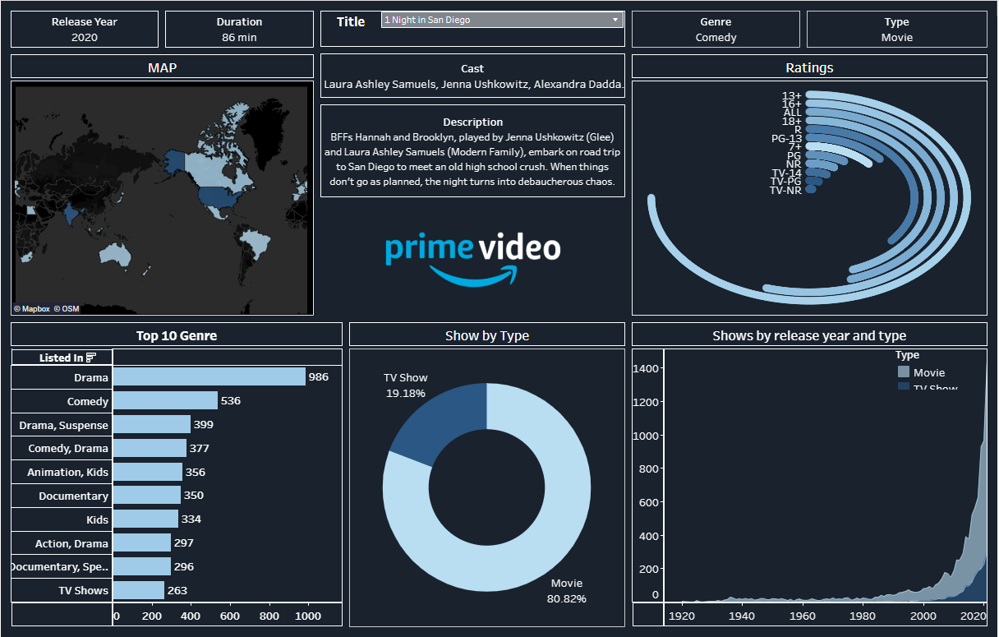

# Prime Video Content Analysis Dashboard

## Project Overview

This project presents an interactive Tableau dashboard designed to explore the Prime Video content catalog across genres, ratings, release years, content types, and geographic distribution.

The dashboard allows users to explore individual titles while also examining broader patterns within the Prime Video catalog.

## Dashboard

## Dashboard Features

The dashboard includes:

- Geographic distribution of Prime Video titles
- Top 10 genres by number of titles
- Distribution of movies and TV shows
- Content trends by release year and type
- Distribution of content ratings
- Interactive title selection
- Individual title details including release year, duration, genre, cast, and description

## Key Insights

- Movies represent approximately 81% of the titles in the dataset, while TV shows account for approximately 19%.
- Drama is the most common genre, followed by Comedy.
- The number of titles increased substantially in more recent release years.
- Prime Video's catalog includes content across multiple countries, genres, and audience ratings.

## Repository Files

- `Tableau.png` — Dashboard preview
- `prime-video-dashboard.twbx` — Packaged Tableau workbook

## Conclusion

This project demonstrates how Tableau can be used to transform entertainment catalog data into an interactive dashboard that enables users to explore content distribution, trends, and individual title information.
